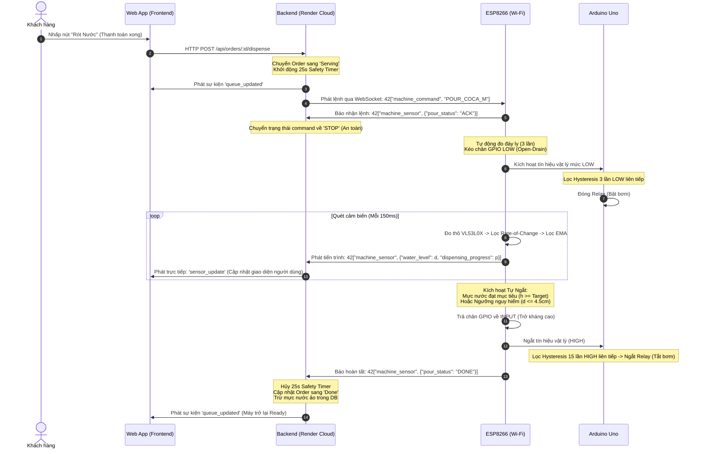

# 🌊 TÀI LIỆU THUẬT TOÁN RÓT NƯỚC THỜI GIAN THỰC (WATER DISPENSING ALGORITHM)
## Dự án: Hệ Thống Bán Nước Thông Minh — Smart IoT Vending System

Tài liệu này trình bày chi tiết về kiến trúc luồng dữ liệu, các thuật toán xử lý tín hiệu số (DSP), cơ chế ngắt an toàn và chỉ ra chính xác các tệp tin, hàm số, dòng mã chịu trách nhiệm thực thi quy trình rót nước trên **ESP8266** và **Backend (Node.js/Socket.IO)**.

---

## 📊 1. KIẾN TRÚC TỔNG QUAN & BẢN ĐỒ GIAO TIẾP REALTIME

Quy trình rót nước hoạt động trên cơ chế giao tiếp hai chiều thời gian thực thông qua giao thức **WebSockets (Socket.IO v4)**:

---

## 🛠️ 2. CHI TIẾT THUẬT TOÁN ĐO VÀ LỌC NHIỄU SỐ TRÊN ESP8266

Để đo mực nước chính xác đến từng milimet khi dòng nước chảy xiết và bọt khí xuất hiện liên tục, ESP8266 áp dụng chuỗi xử lý tín hiệu số (DSP) bao gồm 6 cấu phần:

### 2.1. Tự Động Hiệu Chuẩn Đáy Ly (Auto-Calibration)
Trước khi máy bắt đầu bơm nước, ESP8266 thực hiện đo nhanh 3 mẫu khoảng cách từ cảm biến xuống khay chứa để xác định chính xác cao độ đáy ly thực tế.
*   **Mục đích:** Khắc phục sai số do các loại ly có độ cao hoặc độ dày đáy khác nhau, tạo điểm mốc chuẩn không để tính toán lượng nước dâng lên.

### 2.2. Bộ Lọc Tốc Độ Biến Thiên (Rate-of-Change Filter)
Ngăn chặn các phép đo sai lệch nhảy vọt đột ngột (outlier spikes) do bọt nước cản tia laser hoặc bề mặt nước bị gợn sóng mạnh.
*   **Thuật toán:** Chỉ chấp nhận giá trị mới nếu độ lệch so với khoảng cách đã lọc trước đó không vượt quá $2.0\text{ cm}$:
    $$\left| \text{RawDistance}_n - \text{FilteredDistance}_{n-1} \right| \le 2.0\text{ cm}$$

### 2.3. Bộ Lọc Thông Thấp Trung Bình Động Lũy Thừa (EMA Filter)
Làm mịn các dao động sóng nước nhỏ để phần trăm tiến độ hiển thị mượt mà trên App điện thoại.
*   **Phương trình toán học:**
    $$\text{FilteredDistance}_n = 0.35 \cdot \text{RawDistance}_n + 0.65 \cdot \text{FilteredDistance}_{n-1}$$

### 2.4. Thuật toán Tự Khôi Phục Kẹt Tín Hiệu (Latching Recovery)
Nếu người dùng rút ly ra hoặc dịch chuyển nhanh, khoảng cách thay đổi lớn là có thật. Bộ lọc Rate-of-Change sẽ chặn nó vì nghĩ là nhiễu.
*   **Thuật toán:** Đếm số lần bị bộ lọc Rate-of-Change chặn liên tiếp. Nếu bị chặn **liên tiếp 5 lần** (~750ms), hệ thống xác nhận khoảng cách thay đổi thật sự và ép bộ lọc EMA cập nhật giá trị mới lập tức.

### 2.5. Thuật toán Tự Ngắt An Toàn Kép (Dual-Autostop System)
Bơm sẽ tự động ngắt khi thỏa mãn 1 trong 2 điều kiện:
1.  **Đạt mức nước mục tiêu (Target Height):** Chiều cao cột nước dâng lên ($h_{\text{nước}} = \text{Đáy ly} - \text{Mực nước hiện tại}$) đạt ngưỡng cài đặt của Size ly (S: 4.0cm, M: 6.5cm, L: 9.0cm) liên tục **1 lần đo**.
2.  **Ngắt khẩn cấp chống tràn (Safe-Distance Autostop):** Khoảng cách tuyệt đối từ đầu cảm biến xuống mặt nước chạm ngưỡng nguy hiểm $\le 4.5\text{ cm}$ liên tục **2 lần đo**.

### 2.6. Thuật toán Dự Phòng Sự Cố (Fallback Timer)
*   **Thuật toán:** Nếu cảm biến bị đọng nước, lỏng cáp hoặc hỏng hoàn toàn trong lúc đang rót khiến hệ thống mất tín hiệu quá **30 chu kỳ đo** (~4.5 giây), ESP lập tức cô lập cảm biến và chuyển sang tự ngắt theo thời gian khống chế cứng (Size S: 8s, Size M: 12s, Size L: 16s).

---

## 📂 3. BẢN ĐỒ CHỈ RA CODE THỰC TẾ Ở ESP VÀ BACKEND

### 📍 3.1. CODE TRÊN ESP8266 (`firmware/esp.cpp`)

Tất cả logic xử lý đo đạc và lọc nhiễu của ESP8266 nằm trong tệp tin [esp.cpp](file:///d:/MyProjects/Smart%20IoT%20Vending%20System/Smart-IoT-Vending-System/firmware/esp.cpp):

| Thuật toán / Logic | Hàm xử lý | Dòng mã (Line Range) | Mô tả chi tiết |
| :--- | :--- | :--- | :--- |
| **Giao tiếp WebSocket Socket.IO** | `webSocketEvent()` | [L157-L217](file:///d:/MyProjects/Smart%20IoT%20Vending%20System/Smart-IoT-Vending-System/firmware/esp.cpp#L157-L217) | Thực hiện bắt tay Engine.IO, trả lời Ping/Pong và tách sự kiện `machine_command` từ gói JSON để kích hoạt luồng rót. |
| **Đọc khoảng cách cảm biến thô** | `getRawDistance()` | [L39-L48](file:///d:/MyProjects/Smart%20IoT%20Vending%20System/Smart-IoT-Vending-System/firmware/esp.cpp#L39-L48) | Gọi thư viện `Adafruit_VL53L0X`, đọc dải đo ToF bằng tia laser và quy đổi đơn vị từ mm sang cm. |
| **Cấu hình thông số cột nước & thời gian** | *Biến const* | [L50-L60](file:///d:/MyProjects/Smart%20IoT%20Vending%20System/Smart-IoT-Vending-System/firmware/esp.cpp#L50-L60) | Khai báo độ cao mục tiêu cho size S, M, L (4.0cm, 6.5cm, 9.0cm) và thời gian khống chế dự phòng (8s, 12s, 16s). |
| **Hiệu chuẩn đáy ly tự động** | `xuLyLenh()` | [L255-L272](file:///d:/MyProjects/Smart%20IoT%20Vending%20System/Smart-IoT-Vending-System/firmware/esp.cpp#L255-L272) | Khi nhận lệnh rót, đo nhanh lấy trung bình cộng 3 mẫu hợp lệ để gán cao độ đáy ly cho biến `cupBaseDistance`. |
| **Mạch điều khiển Open-Drain** | `batBom()` / `tatBom()` | [L132-L152](file:///d:/MyProjects/Smart%20IoT%20Vending%20System/Smart-IoT-Vending-System/firmware/esp.cpp#L132-L152) | Bật bơm bằng cách đưa GPIO sang `OUTPUT` mức `LOW`. Tắt bơm bằng cách đưa chân về `INPUT` (trở kháng cao) cực kỳ an toàn. |
| **Bộ lọc nhiễu DSP & Tự ngắt** | `loop()` | [L401-L485](file:///d:/MyProjects/Smart%20IoT%20Vending%20System/Smart-IoT-Vending-System/firmware/esp.cpp#L401-L485) | Quét chu kỳ 150ms, chạy bộ lọc Rate-of-Change, EMA ($\alpha = 0.35$), Latching Recovery, đếm nguy hiểm/đích và tự động dừng. |
| **Chạy Hẹn giờ dự phòng (Fallback)** | `loop()` | [L487-L503](file:///d:/MyProjects/Smart%20IoT%20Vending%20System/Smart-IoT-Vending-System/firmware/esp.cpp#L487-L503) | Kích hoạt bộ đếm thời gian dự phòng để ngắt bơm nếu mất cảm biến đột ngột quá 4.5 giây khi đang rót. |
| **Phát hiện sụt/Mất mạng WiFi** | `loop()` | [L380-L391](file:///d:/MyProjects/Smart%20IoT%20Vending%20System/Smart-IoT-Vending-System/firmware/esp.cpp#L380-L391) | Nếu đang rót mà mất mạng Wi-Fi quá 5.0 giây, lập tức ngắt bơm cưỡng bức đề phòng mất liên kết và tự động kết nối lại. |
| **Phát tín hiệu Realtime qua WS** | `guiBaoCaoRotWebSocket()` | [L107-L127](file:///d:/MyProjects/Smart%20IoT%20Vending%20System/Smart-IoT-Vending-System/firmware/esp.cpp#L107-L127) | Định dạng chuỗi JSON `42["machine_sensor", ...]` và gửi trực tiếp qua kết nối socket lên Server Cloud. |

---

### 📍 3.2. CODE TRÊN NODE.JS BACKEND (`backend/src`)

Toàn bộ logic vận hành hàng đợi phân phối nước, kiểm soát lỗi và đồng bộ hóa Web App được triển khai ở backend:

| Thuật toán / Logic | File & Hàm xử lý | Dòng mã (Line Range) | Mô tả chi tiết |
| :--- | :--- | :--- | :--- |
| **Nhận tín hiệu từ ESP8266** | [socket.js](file:///d:/MyProjects/Smart%20IoT%20Vending System/Smart-IoT-Vending-System/backend/src/config/socket.js) Sự kiện `'machine_sensor'` | [L17-L28](file:///d:/MyProjects/Smart%20IoT%20Vending%20System/Smart-IoT-Vending-System/backend/src/config/socket.js#L17-L28) | Lắng nghe trực tiếp luồng dữ liệu liên tục từ ESP8266, parse JSON an toàn và gọi hàm `updateSensor` ở lớp Service. |
| **Khởi động Quy trình rót** | [MachineService.js](file:///d:/MyProjects/Smart%20IoT%20Vending%20System/Smart-IoT-Vending-System/backend/src/services/MachineService.js) `dispenseDrink()` | [L30-L71](file:///d:/MyProjects/Smart%20IoT%20Vending%20System/Smart-IoT-Vending-System/backend/src/services/MachineService.js#L30-L71) | Chuyển trạng thái DB đơn sang `'Serving'`, khóa máy bán nước sang bận, kích hoạt bộ hẹn giờ an toàn 25s, phát lệnh `machine_command` (Ví dụ: `POUR_COCA_M`) qua WS tới ESP8266. |
| **Cơ chế Bảo vệ Safety Timeout 25s** | [MachineService.js](file:///d:/MyProjects/Smart%20IoT%20Vending%20System/Smart-IoT-Vending-System/backend/src/services/MachineService.js) `dispenseDrink()` | [L49-L59](file:///d:/MyProjects/Smart%20IoT%20Vending%20System/Smart-IoT-Vending-System/backend/src/services/MachineService.js#L49-L59) | Đề phòng ESP treo hoặc mất mạng hoàn toàn: Tự động giải phóng trạng thái máy bán nước về 'Ready' và hoàn tất đơn hàng sau 25s nếu không thấy ESP báo cáo 'DONE'. |
| **Hoàn tất đơn & Trừ nước ảo** | [MachineService.js](file:///d:/MyProjects/Smart%20IoT%20Vending%20System/Smart-IoT-Vending-System/backend/src/services/MachineService.js) `completeOrder()` | [L74-L114](file:///d:/MyProjects/Smart%20IoT%20Vending%20System/Smart-IoT-Vending-System/backend/src/services/MachineService.js#L74-L114) | Hủy bộ đếm an toàn, phát lệnh dừng `STOP`, trừ thể tích nước ảo trong bình chứa DB dựa theo Size cốc (S: 330ml, M: 500ml, L: 700ml), cập nhật đơn hàng thành `'Done'`, đưa máy về `'Ready'`. |
| **Nhận diện trạng thái DONE** | [MachineService.js](file:///d:/MyProjects/Smart%20IoT%20Vending%20System/Smart-IoT-Vending-System/backend/src/services/MachineService.js) `updateSensor()` | [L171-L188](file:///d:/MyProjects/Smart%20IoT%20Vending%20System/Smart-IoT-Vending-System/backend/src/services/MachineService.js#L171-L188) | Khi nhận gói dữ liệu cảm biến có cờ `pourStatus === 'DONE'`, lập tức gọi hàm `completeOrder()` để chuyển trạng thái máy và giải phóng queue bán hàng. |
| **Tự động ngắt khi rút ly giữa chừng** | [MachineService.js](file:///d:/MyProjects/Smart%20IoT%20Vending%20System/Smart-IoT-Vending-System/backend/src/services/MachineService.js) `updateSensor()` | [L190-L208](file:///d:/MyProjects/Smart%20IoT%20Vending%20System/Smart-IoT-Vending-System/backend/src/services/MachineService.js#L190-L208) | Nếu cảm biến báo `pourStatus === 'CUP_REMOVED'` (người dùng rút ly ra khi đang rót), hệ thống lập tức cưỡng bức tắt bơm dừng khẩn cấp để nước không chảy ra ngoài khay. |
| **Đồng bộ hóa dữ liệu Web App** | [MachineService.js](file:///d:/MyProjects/Smart%20IoT%20Vending%20System/Smart-IoT-Vending-System/backend/src/services/MachineService.js) `updateSensor()` | [L219-L227](file:///d:/MyProjects/Smart%20IoT%20Vending%20System/Smart-IoT-Vending-System/backend/src/services/MachineService.js#L219-L227) | Phát sóng sự kiện `'sensor_update'` mang theo toàn bộ dữ liệu tiến độ realtime về Web App của người dùng cuối để vẽ thanh hiển thị tiến độ rót nước. |

---

## 🛡️ 4. TẤM LỚP BẢO VỆ CHỐNG GIẬT RELAY TRÊN ARDUINO UNO (`firmware/arduino.cpp`)

Để relay không bị đóng cắt liên tục do các gợn nhiễu sóng điện từ (EMI) truyền dẫn qua dây cáp tín hiệu nối chéo từ ESP8266, Arduino Uno chạy thuật toán **Hysteresis State-Debounce**:

*   **Tệp tin xử lý:** [arduino.cpp](file:///d:/MyProjects/Smart%20IoT%20Vending%20System/Smart-IoT-Vending-System/firmware/arduino.cpp)
*   **Logic chống giật (Debounce):**
    *   **Bật bơm:** Chỉ kích hoạt khi đọc được tín hiệu `LOW` **3 lần liên tiếp** từ ESP8266 (Dòng mã [L102-L105](file:///d:/MyProjects/Smart%20IoT%20Vending%20System/Smart-IoT-Vending-System/firmware/arduino.cpp#L102-L105) và [L120-L123](file:///d:/MyProjects/Smart%20IoT%20Vending%20System/Smart-IoT-Vending-System/firmware/arduino.cpp#L120-L123)).
    *   **Tắt bơm:** Chỉ ngắt relay khi đọc được tín hiệu `HIGH` **15 lần liên tiếp** từ ESP8266 (Dòng mã [L110-L113](file:///d:/MyProjects/Smart%20IoT%20Vending%20System/Smart-IoT-Vending-System/firmware/arduino.cpp#L110-L113) và [L127-L130](file:///d:/MyProjects/Smart%20IoT%20Vending%20System/Smart-IoT-Vending-System/firmware/arduino.cpp#L127-L130)).
    *   **Tự ngắt cứng 20s:** Uno đo thời gian chạy của bơm trực tiếp trong `loop()`, tự động ngắt nguồn bơm nếu quá 20 giây để chống cháy nổ động cơ (Dòng mã [L224-L235](file:///d:/MyProjects/Smart%20IoT%20Vending%20System/Smart-IoT-Vending-System/firmware/arduino.cpp#L224-L235)).
    *   **Khôi phục bus I2C LCD:** Gọi `Wire.setWireTimeout(3000, true)` tại [L79](file:///d:/MyProjects/Smart%20IoT%20Vending%20System/Smart-IoT-Vending-System/firmware/arduino.cpp#L79) để giải cứu màn hình LCD khỏi đơ treo do từ trường của cuộn dây động cơ tạo ra.
